<!-- hero: monochrome ASCII portrait (types in) beside the extruded 3d ascii
     wordmark (wipes in left-to-right, then rocks on its vertical axis). -->

<h3><code>sailesh@github ~ $ whoami</code></h3>

<table>
<tr>
<td valign="top"></td>
<td valign="top"></td>
</tr>
</table>

 
 

<!-- animated contribution graph: real data, boxes reveal cell by cell and a snake travels through the gaps
     (regenerated daily by .github/workflows/update-profile-art.yml) -->

<h3><code>sailesh@github ~ $ ./contributions.sh</code></h3>

 
 

<h3><code>sailesh@github ~ $ ./links.sh</code></h3>

<b>AI/ML Engineer | Building Intelligent Systems with LLMs, RAG &amp; Agentic AI</b>

 

